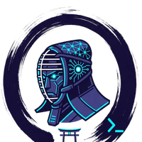

<p align="center">
  
</p>

<h1 align="center">dojops.ai</h1>

<p align="center">
  Landing page for <a href="https://github.com/dojops/dojops">DojOps</a>.
</p>

<p align="center">
  <a href="https://sonarcloud.io/summary/new_code?id=dojops_dojops.ai"></a>
</p>

**Live:** [https://dojops.ai](https://dojops.ai)

## Stack

- Next.js 15 (App Router, static export)
- Tailwind CSS v4 (`@theme inline` for design tokens)
- TypeScript
- Sora (headings/body) + JetBrains Mono (code/terminal)
- Deployed on Vercel

## Project structure

```
src/
├── app/
│   ├── globals.css          # Tailwind theme, brand tokens, animations, keyframes
│   ├── layout.tsx           # Root layout (fonts, metadata, ambient background)
│   └── page.tsx             # Single page assembling all sections
├── components/
│   ├── Navbar.tsx            # Sticky nav with glass blur, mobile drawer
│   ├── Hero.tsx              # Logo, headline, CTA buttons, terminal demo
│   ├── TerminalDemo.tsx      # CSS-animated terminal showing dojops plan
│   ├── InstallSection.tsx    # Tabbed install (npm / curl / Docker) with terminal UI
│   ├── HighlightStats.tsx    # Stats bar (38 skills, 32 agents, 10 scanners, etc.)
│   ├── HowItWorks.tsx        # 3-step flow: Describe → Review → Apply
│   ├── Features.tsx          # 6 feature cards with glow hover
│   ├── ToolsGrid.tsx         # 18 DevOps skills + 6 LLM providers
│   ├── Security.tsx          # 8 security layers grid
│   ├── Footer.tsx            # Final CTA + links
│   ├── FloatingIconsBg.tsx   # Atmospheric floating DevOps tool icons background
│   ├── ScrollReveal.tsx      # Intersection Observer scroll-triggered animations
│   ├── SectionHeading.tsx    # Reusable section title + subtitle
│   ├── GlowCard.tsx          # Reusable card with neon glow hover
│   └── CopyButton.tsx        # Copy-to-clipboard button
└── lib/
    └── constants.ts          # All content data, links, features, tools, terminal lines
```

## Page sections

1. Hero — animated logo, headline, CTA buttons, terminal demo
2. Get started — tabbed install commands (npm/curl/Docker) + "What's next" steps
3. Stats bar — 38 skills, 32 agents, 10 scanners, 7 providers, 8 security layers, 23 endpoints
4. How it works — Describe → Review → Apply
5. Features — 6 capability cards (agents, planning, validation, sandboxing, scanning, custom skills)
6. Tools and providers — 18 DevOps skills grid + 6 LLM providers
7. Security — 8 defense layers
8. Footer — CTA + links

## Design

Dark cyberpunk theme with neon cyan (`#00e5ff`) on deep black (`#050508`). Floating DevOps tool icons drift at 3-4% opacity in the background. Scroll-triggered reveals via Intersection Observer, staggered entrance delays, terminal typewriter effect, badge shimmer. `prefers-reduced-motion` disables all animations. Noise texture overlay adds depth.

## Development

```bash
npm install       # Install dependencies
npm run dev       # Start dev server (http://localhost:3000)
npm run build     # Static export to out/
npm run lint      # ESLint
```

## Related repos

| Repo                                                      | What it is                                        |
| --------------------------------------------------------- | ------------------------------------------------- |
| [dojops/dojops](https://github.com/dojops/dojops)         | Main monorepo — CLI, API, all @dojops/\* packages |
| [dojops/dojops-doc](https://github.com/dojops/dojops-doc) | Documentation site                                |
| [dojops/dojops-hub](https://github.com/dojops/dojops-hub) | Skill marketplace                                 |

## License

MIT
